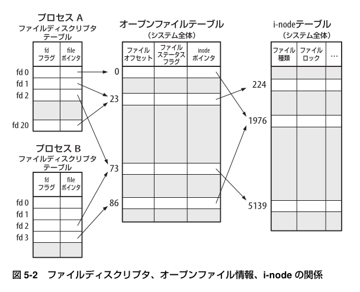
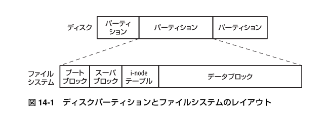
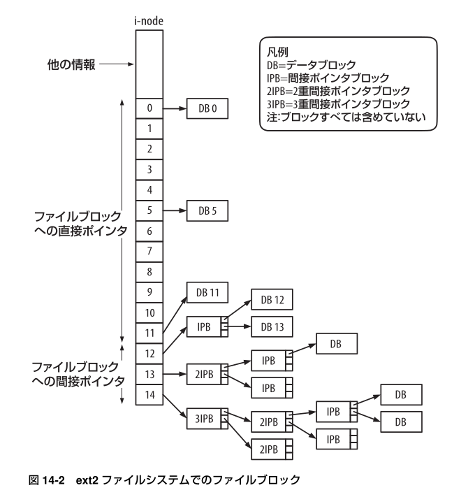
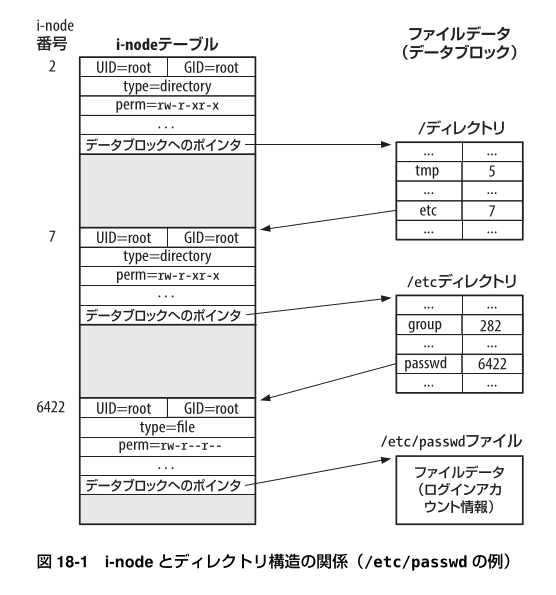
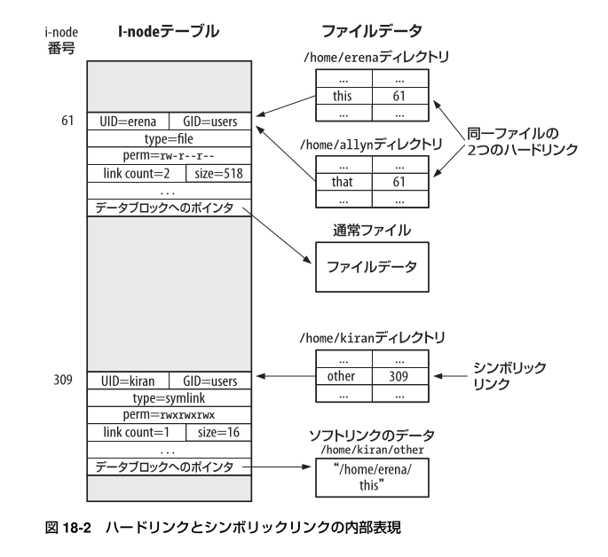
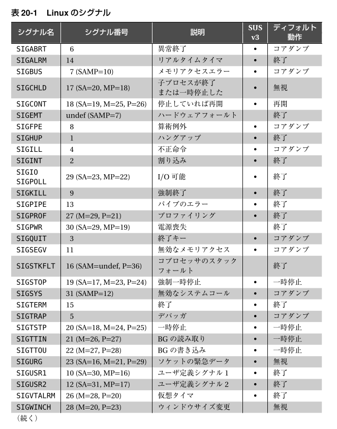

# The Linux Programming Interface

## [4] ファイル I/O : 統一されたインターフェース

### (4.3) ファイルのオープン : open()

- file access mode flags
- file creation flags
- (open) file status flags

## [5] ファイル I/O : その詳細

### (5.4) ファイルディスクリプタとオープンしたファイルの関係

## [6] プロセス

### (6.4) 仮想メモリ管理

## [14] ファイルシステム

### (14.3) ファイルシステム

### (14.4) i-node

## [18] ディレクトリとリンク

### (18.1) ディレクトリと（ハード）リンク

i-node番号
- 0: 未使用
- 1: bad block

## [20] シグナル：基礎

### (20.2) シグナル種類とディフォルト動作

