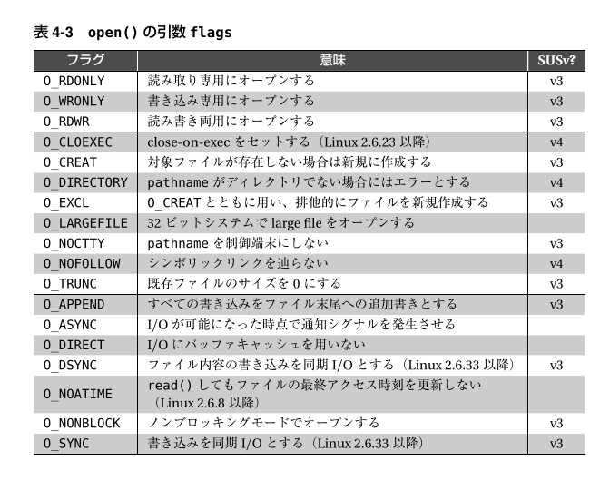
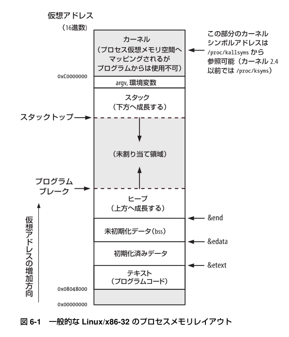

# The Linux Programming Interface

## [4] ファイル I/O : 統一されたインターフェース

### (4.3) ファイルのオープン : open()

- file access mode flags
- file creation flags
- (open) file status flags

## [6] プロセス

### (6.4) 仮想メモリ管理

